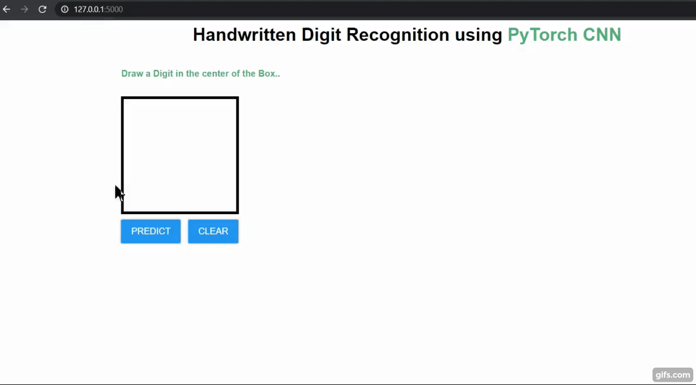

# Handwritten-Digit-Recognition-CNN-Flask-App-
A Convolutional Neural Network model created using PyTorch library over the MNIST dataset to recognize handwritten digits .  

The dataset can be downloaded from here :  
https://drive.google.com/drive/folders/1z4iFh1gJiRS3BpdzhYwf9tZGbh__CDNg?usp=sharing  
Download the dataset and store it in a folder(create new) named "data" in the main directory.
 

The MNIST dataset is an acronym that stands for the Modified National Institute of Standards and Technology dataset.

It is a dataset of 60,000 small square 28×28 pixel grayscale images of handwritten single digits between 0 and 9.

The task is to classify a given image of a handwritten digit into one of 10 classes representing integer values from 0 to 9, inclusively.

It is a widely used and deeply understood dataset and, for the most part, is “solved.” Top-performing models are deep learning convolutional neural networks that achieve a classification accuracy of above 99%, with an error rate between 0.4 %and 0.2% on the hold out test dataset.  
 

The handwritten digit recognition is the capability of computer
applications to recognize the human handwritten digits. It is a
hard task for the machine because handwritten digits are not
perfect and can be made with many different shapes and sizes.
The handwritten digit recognition system is a way to tackle this
problem which uses the image of a digit and recognizes the
digit present in the image.

